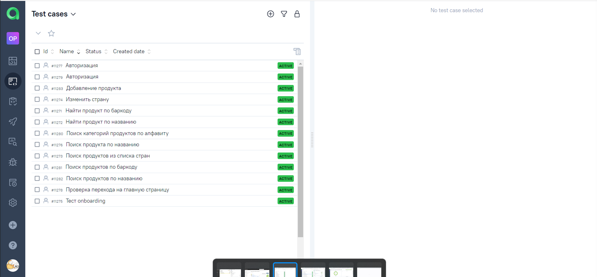
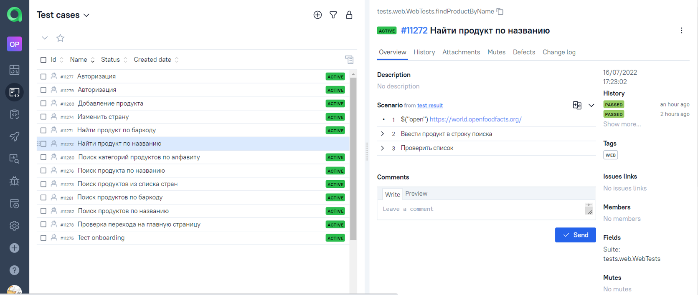
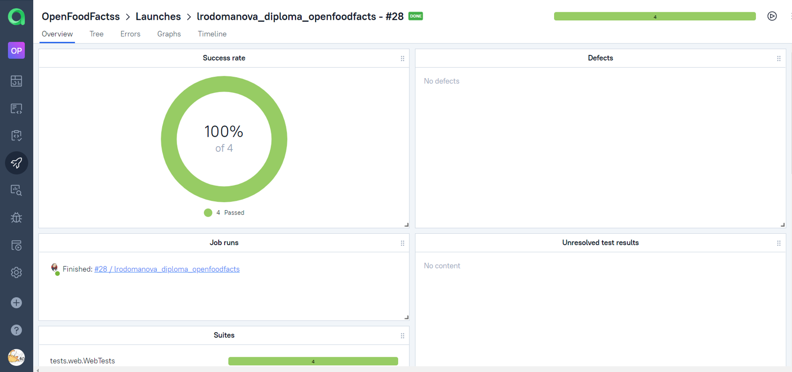
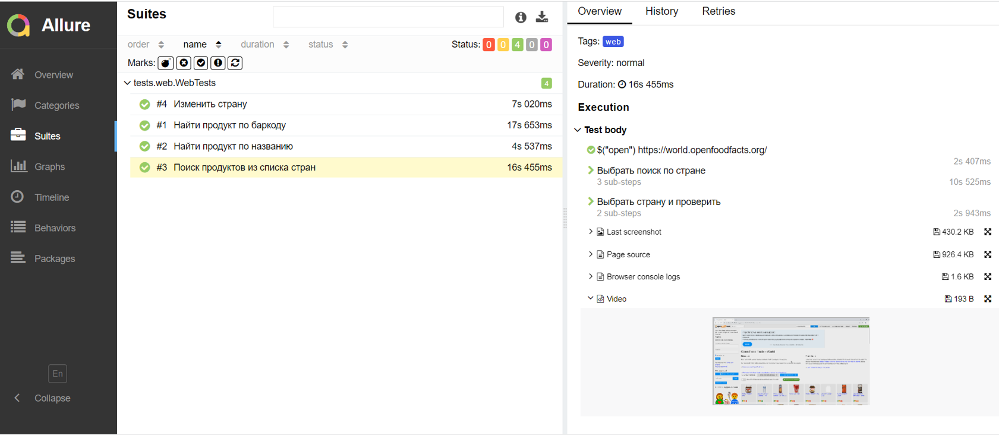

## Проект по автоматизации тестирования сайта openfoodfacts.org"
> <a target="_blank" href="https://world.openfoodfacts.org/">Ссылка на главную страницу сайта</a>
### 
## Описание проекта
Учебный проект реализации автотестирования. Включает web, api и мобильные тесты.
>В качестве объекта тестирования выбран сайт https://world.openfoodfacts.org/ и мобильное приложение с открытым api.<br/>

Сайт позволяет получать подробную информацию о продуктах, выпускаемых во всем мире, а также самому добавлять продукты, которых нет в базе проекта.

###  Проект реализован с использованием
<p align="center">IntelliJ IDEA Java Gradle Selenide Selenoid JUnit5 Jenkins Allure Report Allure TestOps Telegram </p>
<p align="center">


###  Проект включает в себя:
- [x] UI-автотесты веба
- [x] API тесты
- [x] UI-автотесты мобильного приложения
###  Список проверок, реализованных в проекте
- [x] Авторизация
- [x] Поиск продуктов по названию
- [x] Поиск продуктов по баркоду
- [x] Поиск продуктов по странам
- [x] Поиск категорий
- [x] Onboarding тест мобильного приложения
- [x] Добавление продукта на сайт
- [x] Проверка экранов в мобильном приложении

#### Пример запуска из командной строки
```bash
gradle clean web
gradle clean api
gradle clean android
```
## Запуск автотестов выполняется на сервере Jenkins
> <a target="_blank" href="https://jenkins.autotests.cloud/job/lrodomanova_diploma_openfoodfacts">Ссылка на проект в Jenkins</a>


Для запуска тестов выбрать пункт **"Собрать сейчас"**

## Отчёты о результатах сборок, списки тесткейсов, аналитические dashboards хранятся в Allure TestOps
> <a target="_blank" href="https://allure.autotests.cloud/project/1468/dashboards">Сссылка на проект в AllureTestOps</a> (запрос доступа admin@qa.guru)







### Список кейсов в отчёте Allure


## Настроено автоматическое оповещение о результатах сборки Jenkins в Telegram-бот


> К каждому тесту в отчете прилагается видео.
<p align="center">
  
</p>

> Видео прохождения мобильного теста.
<p align="center">
  
</p>